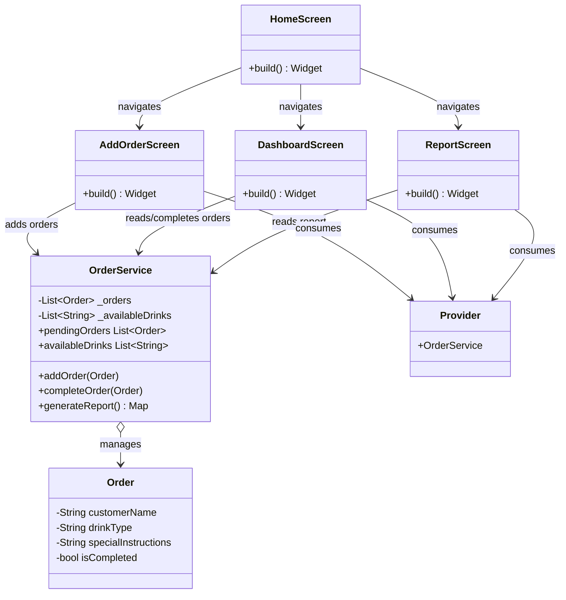

# ☕ Smart Ahwa Manager

A **Flutter-based mobile application** designed for *ahwa* (traditional Egyptian coffee shop) owners to streamline operations. The app addresses the problem of manual order tracking, which is often chaotic and error-prone in busy ahwas. It enables owners to **manage customer orders, track popular items, and generate daily sales reports** to optimize business operations. Built with **Clean Architecture**, **SOLID principles**, and core **OOP concepts** to ensure maintainability and scalability.

## ✨ Features

- 📝 **Add Orders**: Record customer orders with name, drink type (e.g., Shai, Turkish Coffee, Hibiscus Tea), and special instructions (e.g., *"extra mint, ya rais"*).
- 📊 **Dashboard**: View pending orders and mark them as completed.
- 📈 **Sales Reports**: Generate reports showing total orders served and top-selling drinks.
- 📱 **Responsive UI**: Simple and intuitive interface tailored for small business owners.

## 🧩 Architecture and SOLID Principles

The app follows a **Clean Architecture** approach, separating concerns into layers: **models** (data), **services** (business logic), and **screens** (UI). The **Provider** package is used for state management, enabling dependency injection and reactive UI updates. Below is how SOLID principles are applied, along with class relationships and their rationale.

### SOLID Principles Applied

- **Single Responsibility Principle (SRP)**: Each class handles a single responsibility. `Order` manages data, `OrderService` handles business logic, and UI screens (`HomeScreen`, `AddOrderScreen`, etc.) focus solely on presentation.
- **Open-Closed Principle (OCP)**: The `OrderService` supports adding new drink types to `availableDrinks` without modifying core logic, making the app extensible.
- **Dependency Inversion Principle (DIP)**: Uses `Provider` to inject `OrderService` into widgets, ensuring loose coupling between components by depending on abstractions rather than concrete implementations.

### Class Relationships

- **Order (Model)**: Encapsulates order data (`customerName`, `drinkType`, `specialInstructions`, `isCompleted`).
- **OrderService (Service)**: Manages order operations (add, complete, report generation) and exposes read-only data (`pendingOrders`, `availableDrinks`).
- **Screens (UI)**:
  - `HomeScreen`: Navigation hub to other screens.
  - `AddOrderScreen`: Collects input to create `Order` objects.
  - `DashboardScreen`: Displays and updates `pendingOrders`.
  - `ReportScreen`: Shows sales insights from `OrderService`.
- **Provider**: Injects `OrderService` into the widget tree for state management.

### Architecture Diagram



### Why This Design?

The architecture promotes **modularity** and **abstraction**, aligning with *The Object-Oriented Thought Process* by Matt Weisfeld. Encapsulation in `Order` hides internal data, exposing only necessary properties. SRP ensures each class has a single purpose, simplifying maintenance. OCP allows new features (e.g., new drink types) without altering existing code. DIP via `Provider` decouples UI from logic, making testing and updates easier. The diagram visually clarifies data flow, making the codebase intuitive for developers.

## 🛠️ Tech Stack

- **Flutter**: Cross-platform framework for Android and iOS.
- **Dart**: Programming language for app logic.
- **Provider**: State management 
- **SOLID Principles**: SRP, OCP, DIP for clean code.

## 📁 Project Structure

<details>
<summary>Click to expand</summary>

```
smart_ahwa_manager/
├── lib/
│   ├── main.dart                # App entry point
│   ├── models/
│   │   └── order.dart          # Order data model
│   ├── services/
│   │   └── order_service.dart  # Business logic for order management
│   ├── screens/
│   │   ├── home_screen.dart    # Main navigation screen
│   │   ├── add_order_screen.dart # Screen for adding new orders
│   │   ├── dashboard_screen.dart # Screen for viewing pending orders
│   │   └── report_screen.dart   # Screen for sales reports
├── pubspec.yaml                # Dependencies and project config
└── README.md                   # This file
```

</details>

## 🚀 Installation

1. Clone the repository:
   ```bash
   git clone https://github.com/yourusername/smart-ahwa-manager.git
   ```
2. Navigate to the project directory:
   ```bash
   cd smart-ahwa-manager
   ```
3. Install dependencies:
   ```bash
   flutter pub get
   ```
4. Run the app:
   ```bash
   flutter run
   ```

## 📖 Usage

1. Launch the app and navigate to the Home screen.
2. Use **Add Order** to input customer details and drink preferences.
3. View pending orders in the **Dashboard** and mark them as completed.
4. Check daily sales insights via the **Generate Report** option.

### Screenshots

**Home Screen**  


**Add Order Screen**  


**Dashboard Screen**  


**Report Screen**  


